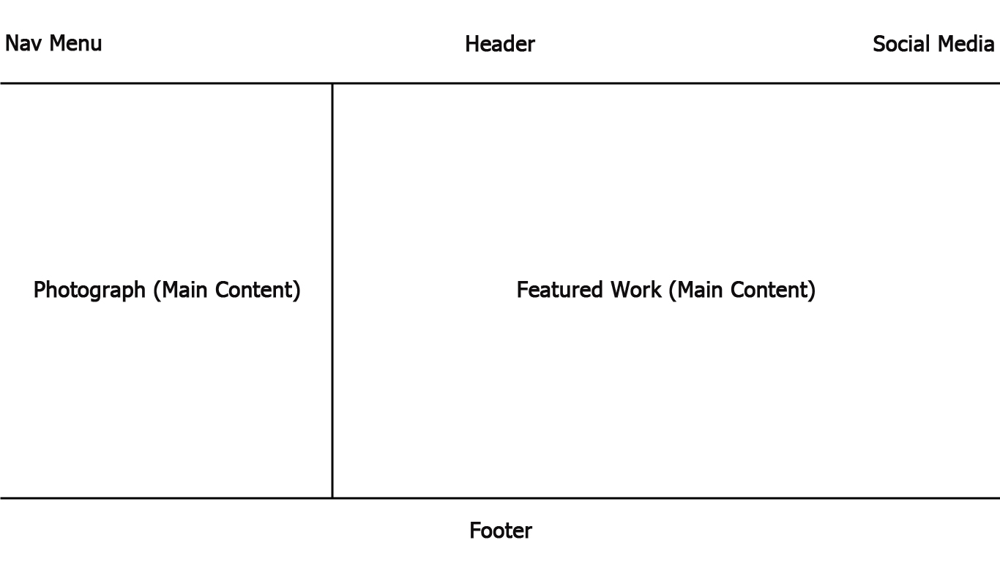
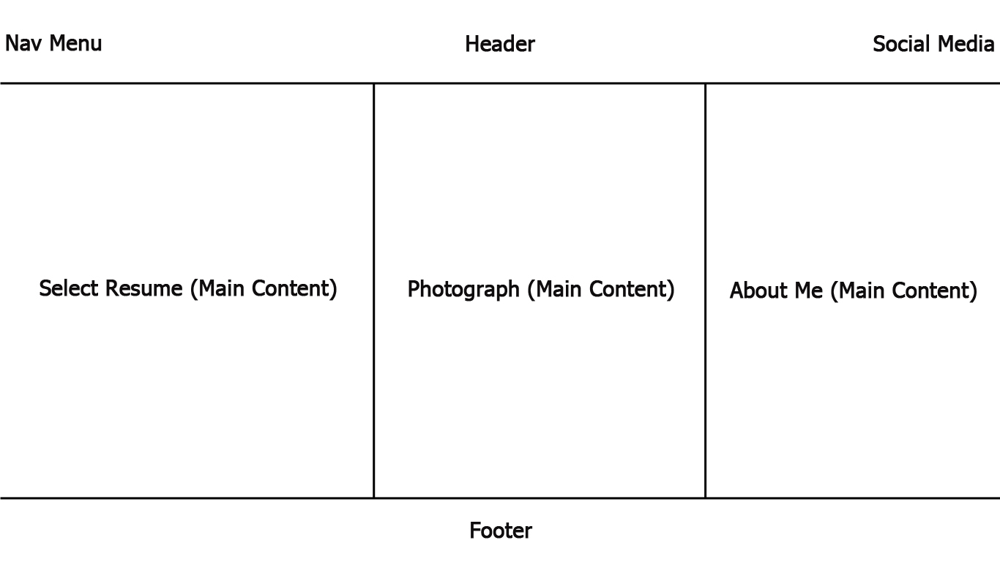
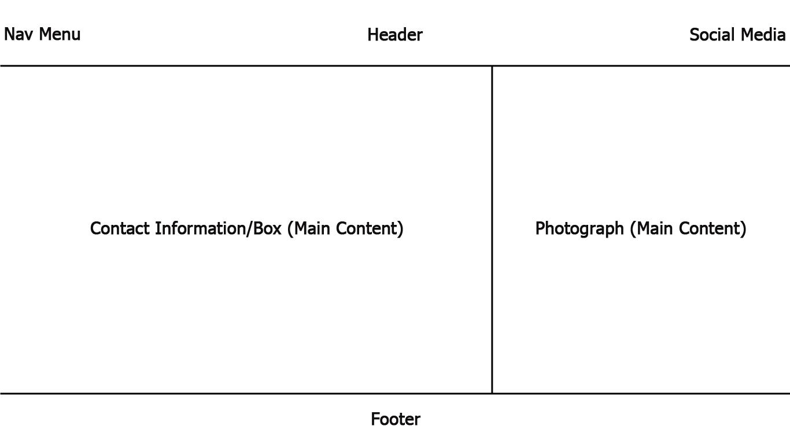

# INF 7420_Project

I am going to build a portfolio site, so that I may showcase my work from the MLIS program to help me find a job once I graduate. 

## Wireframes

I like to be organized and to plan projects before I complete them, so here are some wireframes to show the possible layout and architecture of my site.

Header - Will include my navigation menu, my name, and my social media links

Navigation Menu - Will include links to other pages such as my about me and contact information

Main Content - Will contain a photograph of myself and a featured project such as my reader's advisory posters

Footer - Will include copyright information

Header - Will include my navigation menu, my name, and my social media links

Navigation Menu - Will include links to other pages such as the homepage and contact information

Main Content - Will include a select resume, a photograph of myself, and a small 'about me' biography

Footer - Will include copyright information

Header - Will include my navigation menu, my name, and my social media links

Navigation Menu - Will include links to other pages such as the homepage and contact information

Main Content - Will include my contact information or a contact box and a photograph

Footer - Will include copyright information